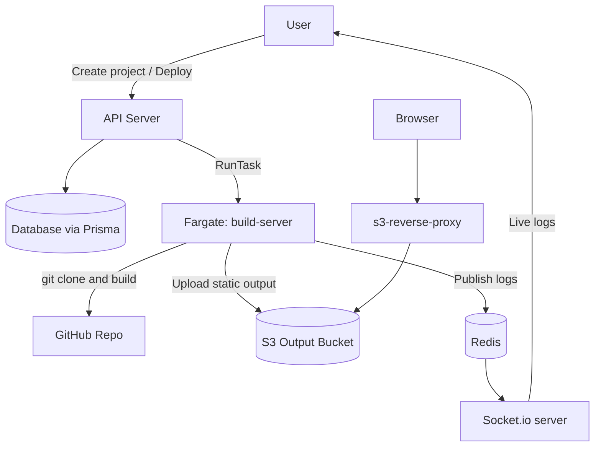

# 🚀 RepoLaunch

> A mini Vercel-like deployment platform — deploy any Git repository to the cloud with a single URL, live build logs, and automatic subdomain routing.

[](https://nodejs.org/)
[](https://expressjs.com/)
[](https://www.docker.com/)
[](https://aws.amazon.com/ecs/)
[](https://aws.amazon.com/s3/)
[](https://redis.io/)
[](https://socket.io/)
[](https://www.prisma.io/)

---

## 📖 Overview

**RepoLaunch** is an end-to-end CI/CD platform that automates the deployment of front-end applications directly from a GitHub URL. Drop in a repo, and RepoLaunch clones it, containerizes the build inside an AWS ECS/Fargate task, uploads the static output to S3, and serves the app through a subdomain-aware reverse proxy — all while streaming real-time build logs to the browser over Socket.io.

This project was built to understand the internals of modern deployment platforms like Vercel and Netlify, exercising a full microservices architecture with cloud-native orchestration, distributed logging, and infrastructure-as-a-service patterns.

---

## ✨ Features

- 🔗 **One-click deployments** from any public Git repository
- 🐳 **Containerized isolated builds** using Docker + AWS ECS Fargate
- ☁️ **Automatic S3 hosting** of built static assets
- 🌐 **Subdomain-based routing** via a custom reverse proxy (`<project>.yourdomain.com`)
- 📡 **Real-time build log streaming** through Redis Pub/Sub + Socket.io
- 💾 **Project & deployment persistence** with Prisma ORM
- 🔒 **Environment variable management** per project
- 🧩 **Microservices architecture** — each service can be scaled independently

---

## 🏗️ Architecture



### The three services

| Service | Role |
| --- | --- |
| **`api-server`** | Express REST API — project CRUD, deployment orchestration via AWS ECS SDK, Prisma-backed persistence, Socket.io gateway with Redis subscriber for streaming live build logs to connected clients |
| **`build-server`** | Dockerized build runner — executes inside an ECS Fargate task; clones the target repo, installs dependencies, runs the build (`npm run build`), uploads the resulting `dist/` output to S3, and publishes per-line logs to Redis |
| **`s3-reverse-proxy`** | Express + `http-proxy` server — inspects incoming subdomain, resolves it to the corresponding S3 path, and transparently proxies static assets back to the client |

---

## 🔧 Tech Stack

**Backend:** Node.js · Express · Prisma ORM  
**Cloud:** AWS ECS Fargate · AWS S3 · AWS IAM  
**Realtime:** Redis Pub/Sub · Socket.io  
**Containerization:** Docker  
**Proxy:** `http-proxy` (subdomain → S3 path mapping)

---

## 🚀 Getting Started

### Prerequisites

- Node.js 18+
- Docker
- An AWS account with ECS, ECR, and S3 access
- A Redis instance (local or Upstash/ElastiCache)
- A database (PostgreSQL recommended — any Prisma-supported DB works)

### 1. Clone & install

```bash
git clone https://github.com/NikunjS91/RepoLaunch.git
cd RepoLaunch

cd api-server && npm install && cd ..
cd build-server && npm install && cd ..
cd s3-reverse-proxy && npm install && cd ..
```

### 2. Configure environment

```bash
cp .env.example .env
```

| Variable | Description |
| --- | --- |
| `DATABASE_URL` | Prisma database connection string |
| `REDIS_URL` | Redis instance for log pub/sub |
| `AWS_REGION` | AWS region (e.g. `us-east-1`) |
| `AWS_ACCESS_KEY_ID` | AWS credentials with ECS + S3 permissions |
| `AWS_SECRET_ACCESS_KEY` | AWS secret key |
| `ECS_CLUSTER` | ARN of your ECS cluster |
| `ECS_TASK_DEFINITION` | ARN of the build-server task definition |
| `AWS_SUBNETS` | Comma-separated subnet IDs for the Fargate task |
| `AWS_SECURITY_GROUPS` | Security group IDs for the Fargate task |
| `S3_BUCKET_NAME` | S3 bucket where build outputs are stored |
| `BASE_PATH` | Base S3 URL used by the reverse proxy |

> ⚠️ **Never commit `.env`** — secrets belong in your deployment environment (AWS Secrets Manager, GitHub Actions secrets, etc.).

### 3. Build & push the build-server image

```bash
cd build-server
docker build -t repolaunch-build-server .
# Tag and push to ECR, then register as an ECS task definition
```

### 4. Run the services locally

```bash
# Terminal 1 — API + Socket.io
cd api-server && npm run dev

# Terminal 2 — Reverse proxy
cd s3-reverse-proxy && npm run dev
```

### 5. Deploy a repo

```bash
curl -X POST http://localhost:9000/project \
  -H "Content-Type: application/json" \
  -d '{"gitURL": "https://github.com/user/some-react-app", "slug": "my-app"}'
```

Connect to the Socket.io channel for that project's `deployment_id` to stream live logs. Once the build completes, your app is live at `http://my-app.<your-proxy-domain>/`.

---

## 📂 Project Structure

```
RepoLaunch/
├── api-server/
│   ├── prisma/
│   │   └── schema.prisma       # DB schema (Project, Deployment models)
│   ├── index.js                # Express app, ECS runner, Socket.io + Redis subscriber
│   ├── prisma.config.ts
│   └── package.json
├── build-server/
│   ├── Dockerfile              # ECS task image
│   ├── script.js               # Clone → build → S3 upload + Redis log publisher
│   ├── main.sh                 # Entrypoint shell script
│   └── package.json
├── s3-reverse-proxy/
│   ├── index.js                # Subdomain → S3 path proxy
│   └── package.json
└── .env.example
```

---

## 🧠 How It Works (End-to-End)

1. **User submits a Git URL** to the API server.
2. **API server** creates a project + deployment record in the database, then invokes the AWS ECS `RunTask` API to spin up a Fargate container from the `build-server` task definition, passing the Git URL and project slug as env vars.
3. **build-server container** boots up, clones the repo, runs `npm install && npm run build`, and walks the resulting `dist/` directory.
4. Each file is **uploaded to S3** under `__outputs/<project-slug>/`, preserving the folder structure.
5. Throughout the build, stdout/stderr are piped into **Redis Pub/Sub** on a channel keyed by deployment ID.
6. The API server's **Socket.io gateway** subscribes to Redis and forwards log events to any browser listening on that deployment's channel — giving the user a live terminal view of their build.
7. When the user visits `<project-slug>.domain.com`, the **s3-reverse-proxy** extracts the subdomain, maps it to the correct S3 path, and proxies the response.

---

## 🎯 What I Learned

- How production deployment platforms (Vercel, Netlify, Cloudflare Pages) orchestrate ephemeral builds at scale
- Running **short-lived, isolated containerized jobs** on AWS Fargate from an API
- Building **real-time infrastructure** with Redis Pub/Sub as a durable message bus between decoupled services
- Subdomain-based routing and **reverse-proxy patterns** for multi-tenant static hosting
- Microservices communication, environment isolation, and IAM-scoped permissions for cross-service AWS calls

---

## 🛣️ Roadmap

- [ ] GitHub webhook integration for auto-deploy on `git push`
- [ ] Custom domain support with ACM + CloudFront
- [ ] Preview deployments per pull request
- [ ] Deployment rollback from the UI
- [ ] Framework auto-detection (Next.js, Vite, CRA, Astro)
- [ ] Build caching layer to speed up repeat deployments
- [ ] Web dashboard (React) for project management and log viewing
- [ ] Terraform module for one-command infrastructure provisioning

---

## 🤝 Contributing

Contributions, issues, and feature requests are welcome. Feel free to open an issue or submit a PR.

## 📄 License

MIT

## 👤 Author

**Nikunj Shetye**

- GitHub: [@NikunjS91](https://github.com/NikunjS91)
- LinkedIn: [nikunj-shetye](https://www.linkedin.com/in/nikunj-shetye)
- Email: nikunjrajendra.shetye@pace.edu

---

> ⭐ If this project helped you understand modern deployment platforms, consider starring the repo!
