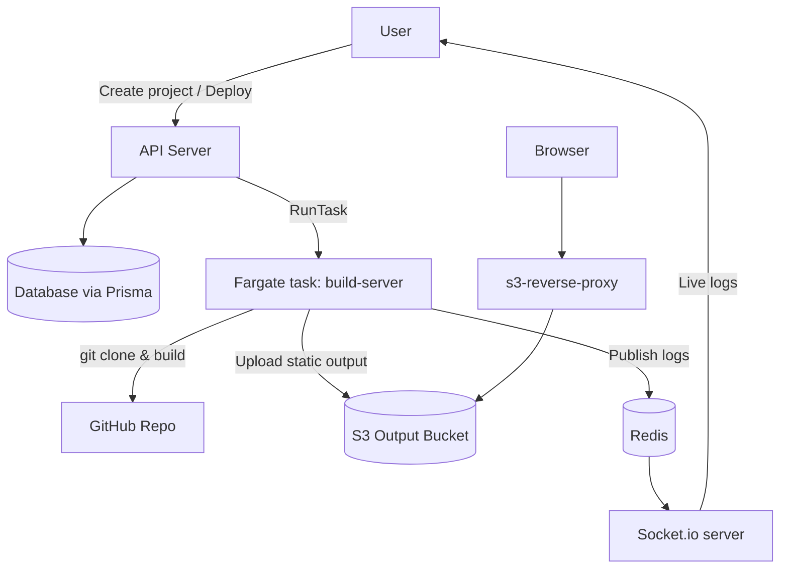

# RepoLaunch

RepoLaunch is a mini Vercel-like platform that takes a GitHub repository URL, builds it on AWS ECS/Fargate, uploads the static output to S3, and serves it via a reverse proxy. Build logs are streamed through Redis and Socket.io so users can see real-time deployment logs.

## Architecture

### Services

- **api-server**: Express API, Prisma database access, ECS task runner, Socket.io + Redis subscriber for live logs.
- **build-server**: Clones the GitHub repo, runs the build, uploads the `dist` output to S3, and publishes logs to Redis.
- **s3-reverse-proxy**: Express + `http-proxy` server that maps subdomains to S3 paths and serves built assets.

## Environment variables

Copy `.env.example` to `.env` and fill in real values (never commit `.env`). Key values:

- `DATABASE_URL` – Prisma database connection string
- `REDIS_URL` – Redis instance used for logs
- `AWS_REGION`, `AWS_ACCESS_KEY_ID`, `AWS_SECRET_ACCESS_KEY`
- `ECS_CLUSTER`, `ECS_TASK_DEFINITION`, `AWS_SUBNETS`, `AWS_SECURITY_GROUPS`
- `S3_BUCKET_NAME` – bucket where build outputs are stored
- `BASE_PATH` – base S3 URL for the reverse proxy

## Development

- `api-server`: standard Node/Express + Prisma server
- `build-server`: Node script run inside a container to build and upload artifacts
- `s3-reverse-proxy`: Node server that forwards requests to S3

## Contributors

- Nikunj Shetye (@NikunjS91)
