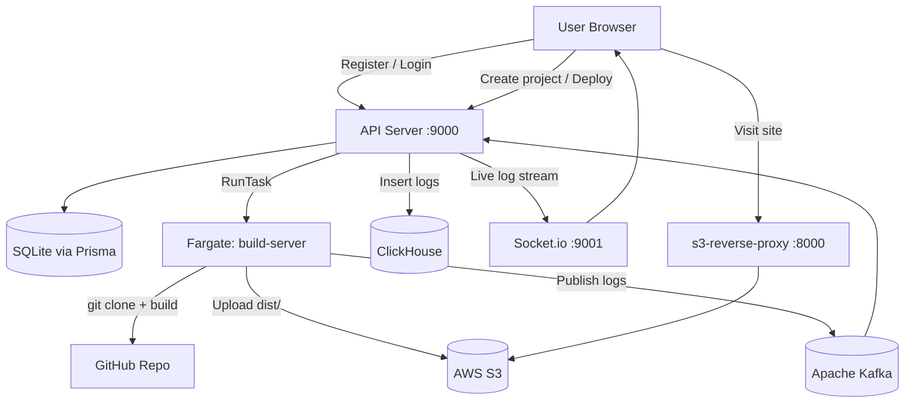

# 🚀 RepoLaunch

> A mini Vercel-like deployment platform — deploy any Git repository to the cloud with a single click, live build logs, and automatic subdomain routing.

[](https://nodejs.org/)
[](https://react.dev/)
[](https://expressjs.com/)
[](https://www.docker.com/)
[](https://aws.amazon.com/ecs/)
[](https://aws.amazon.com/s3/)
[](https://kafka.apache.org/)
[](https://socket.io/)
[](https://www.prisma.io/)

---

## 📖 Overview

**RepoLaunch** is an end-to-end CI/CD platform that automates the deployment of front-end applications directly from a GitHub URL. Drop in a repo, and RepoLaunch clones it, containerizes the build inside an AWS ECS/Fargate task, uploads the static output to S3, and serves the app through a subdomain-aware reverse proxy — all while streaming real-time build logs to the browser.

The platform includes a full-stack React dashboard with user authentication, so every user sees only their own projects and deployments.

Built to understand the internals of modern deployment platforms like Vercel and Netlify, exercising microservices architecture, cloud-native orchestration, distributed log streaming with Kafka + ClickHouse, and JWT-based multi-user auth.

---

## ✨ Features

- 🔐 **User authentication** — JWT-based register/login; each user sees only their own projects
- 🔗 **One-click deployments** from any public Git repository
- 🐳 **Containerized isolated builds** via Docker + AWS ECS Fargate
- ☁️ **Automatic S3 hosting** of built static assets
- 🌐 **Subdomain-based routing** via a custom reverse proxy (`<project>.yourdomain.com`)
- 📡 **Real-time build log streaming** through Kafka + Socket.io
- 🗄️ **Queryable log history** stored in ClickHouse
- 💾 **Project & deployment persistence** with Prisma ORM
- 🖥️ **React dashboard** — project grid, deployment history, live terminal log view
- 🧩 **Microservices architecture** — each service scales independently

---

## 🏗️ Architecture



### Services

| Service | Port | Role |
|---------|------|------|
| **`api-server`** | 9000 + 9001 | Express REST API — auth, project CRUD, ECS orchestration, Kafka consumer → ClickHouse, Socket.io gateway |
| **`build-server`** | — (Fargate) | Ephemeral Docker container — clones repo, builds, uploads `dist/` to S3, publishes logs to Kafka |
| **`s3-reverse-proxy`** | 8000 | Extracts subdomain from hostname, maps to S3 path, proxies response |
| **`frontend`** | 3000 | React + Vite dashboard — auth pages, project management, live log terminal |

---

## 🔧 Tech Stack

| Layer | Technologies |
|-------|-------------|
| **Frontend** | React 18, Vite, Tailwind CSS, React Router, Socket.io client |
| **Backend** | Node.js, Express, Prisma ORM, JWT, bcrypt |
| **Database** | SQLite (local dev) / PostgreSQL (production) |
| **Log Pipeline** | Apache Kafka → ClickHouse |
| **Realtime** | Socket.io |
| **Cloud** | AWS ECS Fargate, AWS S3, AWS IAM |
| **Containerization** | Docker |
| **Proxy** | `http-proxy` (subdomain → S3) |

---

## 🚀 Getting Started

### Prerequisites

- Node.js 18+
- Docker
- AWS account with ECS, ECR, and S3 access
- Apache Kafka instance
- ClickHouse instance
- (Optional) PostgreSQL for production

### 1. Clone & install

```bash
git clone https://github.com/NikunjS91/RepoLaunch.git
cd RepoLaunch

cd api-server    && npm install && cd ..
cd build-server  && npm install && cd ..
cd s3-reverse-proxy && npm install && cd ..
cd frontend      && npm install && cd ..
```

### 2. Configure environment

**`api-server/.env`**

```env
DATABASE_URL="file:./dev.db"
JWT_SECRET=your-secret-key-change-in-prod

# AWS
AWS_REGION=us-east-1
AWS_ACCESS_KEY_ID=your-key
AWS_SECRET_ACCESS_KEY=your-secret
ECS_CLUSTER=arn:aws:ecs:...
ECS_TASK_DEFINITION=arn:aws:ecs:...
AWS_SUBNETS=subnet-xxx,subnet-yyy
AWS_SECURITY_GROUPS=sg-xxx

# Kafka (fill in your broker details)
# KAFKA_BROKER=your-broker:9092

# ClickHouse
# CLICKHOUSE_HOST=https://your-instance
# CLICKHOUSE_DB=default
# CLICKHOUSE_USER=default
# CLICKHOUSE_PASSWORD=your-password
```

**`frontend/.env`**

```env
VITE_API_URL=http://localhost:9000
VITE_SOCKET_URL=http://localhost:9001
```

| Variable | Description |
|----------|-------------|
| `DATABASE_URL` | Prisma DB URL (`file:./dev.db` for SQLite) |
| `JWT_SECRET` | Secret for signing JWTs — keep this private |
| `AWS_*` | Credentials and resource ARNs for ECS + S3 |
| `VITE_API_URL` | Frontend → api-server base URL |
| `VITE_SOCKET_URL` | Frontend → Socket.io server URL |

### 3. Set up the database

```bash
cd api-server
npx prisma migrate dev --name init
```

This creates `dev.db` (SQLite) with the `User`, `Project`, and `Deployment` tables.

### 4. Build & push the build-server Docker image

```bash
cd build-server
docker build -t repolaunch-build-server .
# Tag and push to ECR, then register as an ECS task definition
```

### 5. Run everything locally

```bash
# Terminal 1 — API server + Socket.io
cd api-server && node index.js

# Terminal 2 — Reverse proxy (serves deployed sites)
cd s3-reverse-proxy && node index.js

# Terminal 3 — Frontend dashboard
cd frontend && npm run dev
```

Open **http://localhost:3000**, register an account, and start deploying.

---

## 📂 Project Structure

```
RepoLaunch/
├── api-server/
│   ├── prisma/
│   │   ├── schema.prisma        # User, Project, Deployment models
│   │   └── migrations/          # Migration history
│   ├── generated/prisma/        # Prisma Client output
│   ├── index.js                 # Express app, auth, ECS runner, Kafka consumer, Socket.io
│   ├── prisma.config.ts
│   └── package.json
├── build-server/
│   ├── Dockerfile               # ECS task image (Ubuntu + Node 20)
│   ├── script.js                # Clone → build → S3 upload + Kafka log publisher
│   ├── main.sh                  # Container entrypoint
│   └── package.json
├── s3-reverse-proxy/
│   ├── index.js                 # Subdomain → S3 path proxy
│   └── package.json
├── frontend/
│   ├── src/
│   │   ├── context/AuthContext.jsx   # JWT auth state + login/logout
│   │   ├── pages/
│   │   │   ├── Login.jsx
│   │   │   ├── Register.jsx
│   │   │   ├── Dashboard.jsx         # Project grid
│   │   │   ├── NewProject.jsx        # Create + auto-deploy form
│   │   │   ├── ProjectDetail.jsx     # Project info + deployment history
│   │   │   └── DeploymentLogs.jsx    # Live log terminal
│   │   ├── hooks/                    # useProjects, useProject, useDeployLogs, useSocketLogs
│   │   ├── lib/api.js                # Axios + JWT interceptor
│   │   └── lib/socket.js             # Socket.io singleton
│   └── package.json
└── .env.example
```

---

## 🧠 How It Works (End-to-End)

1. **User registers / logs in** → API returns a signed JWT stored in the browser.
2. **User submits a Git URL** on the dashboard → `POST /project` creates a project record owned by that user → `POST /deploy` queues a deployment.
3. **API server** calls `AWS ECS RunTask`, spinning up an ephemeral Fargate container with the Git URL, project ID, and deployment ID injected as environment variables.
4. **build-server container** boots, clones the repo, runs `npm install && npm run build`, walks `dist/`, and uploads each file to S3 under `__outputs/<project-id>/`.
5. Throughout the build, stdout is published line-by-line to **Apache Kafka** (`container-logs` topic).
6. The **API server's Kafka consumer** reads each batch, inserts rows into **ClickHouse** (`log_events` table), and forwards live log lines to connected Socket.io clients subscribed to that deployment's channel.
7. The **frontend terminal** shows historical logs (fetched from `GET /logs/:id`) and streams live lines via Socket.io — giving the user a real-time build view with color-coded output.
8. When the user visits `<project-slug>.localhost:8000`, the **s3-reverse-proxy** extracts the subdomain, maps it to the S3 path, and proxies the static assets back.

---

## 🔐 Authentication Flow

```
Register/Login → POST /auth/register or /auth/login
             ← JWT (7-day expiry) + { id, email }

All subsequent requests:
  Authorization: Bearer <token>
  → authenticateToken middleware verifies JWT
  → req.user = { id, email }
  → Projects filtered by req.user.id
```

Users can only read, deploy, and view logs for projects they created. Attempting to access another user's project returns `404 Not Found`.

---

## 🖥️ Dashboard Pages

| Route | Page | Description |
|-------|------|-------------|
| `/login` | Login | Email + password sign-in |
| `/register` | Register | Create a new account |
| `/` | Dashboard | Grid of all your projects with last deployment status |
| `/new` | New Project | Import a Git repo — creates project + triggers first deploy |
| `/project/:id` | Project Detail | Info, live site link, deployment history table |
| `/project/:id/deploy/:deploymentId` | Deployment Logs | Live terminal streaming build output |

---

## 🎯 What I Learned

- How production deployment platforms (Vercel, Netlify) orchestrate ephemeral builds at scale
- Running **short-lived isolated containerized jobs** on AWS Fargate triggered from an API
- **Kafka → ClickHouse** log pipeline for durable, queryable build output
- **Real-time log streaming** combining a message queue with Socket.io
- **JWT authentication** with per-resource ownership enforcement in a REST API
- Subdomain-based routing and **reverse-proxy patterns** for multi-tenant static hosting
- Microservices communication, environment isolation, and IAM-scoped permissions

---

## 🛣️ Roadmap

- [ ] GitHub webhook integration for auto-deploy on `git push`
- [ ] Deployment status updates via Kafka (update DB from build-server)
- [ ] Custom domain support with ACM + CloudFront
- [ ] Preview deployments per pull request
- [ ] Deployment rollback from the UI
- [ ] Framework auto-detection (Next.js, Vite, CRA, Astro)
- [ ] Build caching layer to speed up repeat deployments
- [ ] Terraform module for one-command infrastructure provisioning

---

## 🤝 Contributing

Contributions, issues, and feature requests are welcome. Feel free to open an issue or submit a PR.

## 📄 License

MIT

## 👤 Author

**Nikunj Shetye**

- GitHub: [@NikunjS91](https://github.com/NikunjS91)
- LinkedIn: [nikunj-shetye](https://www.linkedin.com/in/nikunj-shetye)
- Email: nikunjrajendra.shetye@pace.edu

---

> ⭐ If this project helped you understand modern deployment platforms, consider starring the repo!
